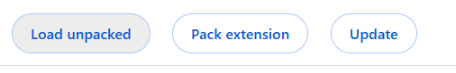

# OBOR Autofill Extension

OBOR Autofill Extension is a chrome extension that autofills inputs for this specific volleyball court booking website: https://bazesportive.sibiu.ro/obor

## Motivation

There are a lot of autofill extensions, even one that comes by default on most browsers, but for this specific website, I needed something better than the default autofill. The reason is that I need to fill a lot of inputs with different values for different people. That's why I built this chrome extension to store all of the needed data at a button's click distance.

## Quick Use

### 1. Download the extension files from under the releases tab

Download the extension files from this github repository. Download the latest release.


After the download has finished, make sure to unzip the files!

### 2. Browse the extensions settings of your browser

If using chrome, browse to chrome://extensions page and enable developer mode from the top right corner. For other browsers, make sure to check their documentation.


### 3. Load the extension files

Next click on the load unpacked option and select the unzipped folder.



### 4. Done

You're done! Go to https://bazesportive.sibiu.ro/obor, choose a court, the date and time and click on the extension to autofill with the desired person's credentials.

## Running this locally

Interested in playing with this web extension? This is a guide on how to get started with this code.

### 1. Clone the repository

```bash
git clone https://github.com/Turturicarv2/obor-autofill-extension.git
cd obor-autofill-extension
```

### 2. Install the necessary packages

```bash
npm install
```

### 3. Edit the files

You need to be aware of the underlying functionality of the extension before getting to the editing part. This web extension has a couple of important files:

- manifest.json
    This file is necessary in all web extensions and it provides a basic layout of the web extension. No need to change this file unless adding more functionality.
- popup.html
    This is the html file that will pop when clicking on the extension icon
- src/scripts/popup.ts
    Typescript file that sends messages from each of the buttons from pop.html to the worker service
- src/scripts/content.ts
    The worker service file that interacts with the DOM and fills the input elements.

### 4. Build and restart the extension

To build the new files you will need to run the following script:

```bash
npm run build
```

And then load/restart the extension from chrome://extensions.